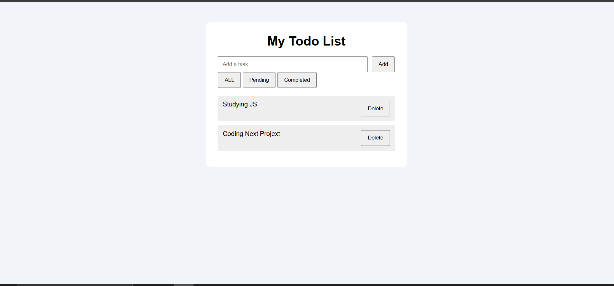

# ✅ Todo List App V2

A simple and responsive Todo List application built with vanilla JavaScript.  
Users can create, update, complete, and delete tasks with data saved using Local Storage.

## 🚀 Features

- ✅ Add new tasks
- ✏️ Edit existing tasks
- 🗑️ Delete tasks
- ☑️ Mark tasks as completed
- 💾 Save tasks using Local Storage
- 🔄 Persistent data after refreshing the page
- 📱 Responsive design

## 🛠️ Technologies Used

- HTML5
- CSS3
- JavaScript (ES6)
- Local Storage API

## 📸 Screenshot



## 🔗 Live Demo

[View Live Demo](https://nico-devstudio.github.io/todo-app-v2/)

## ⚙️ How to Run

1. Clone this repository

```bash
git clone https://github.com/nico-devstudio/todo-app-v2.git
```

2. Open index.html in your browser

## 🧠 What I Learned

- DOM manipulation
- Event handling
- Working with arrays and objects
- Using array methods like map(), filter(), and forEach()
- CRUD operations
- Local Storage API
- JSON.stringify() and JSON.parse()

## 🔮 Future Improvements

Add task categories
Add due dates
Add dark mode
Add drag-and-drop sorting

## 👨‍💻 Author

Nico Angelo
